# Лабораторная работа № 2 - Условный оператор

**Время выполнения - 4 часа**

## Содержание
___
1. [Общие теоретические сведения](#общие-теоретические-сведения)
2. [Задания для самостоятельного выполнения (по вариантам)](#задания-для-самостоятельного-выполнения-по-вариантам)
    * [Задание 1](#задание-1-написать-программу)
    * [Задание 2](#задание-2-написать-программу)
    * [Задание 3](#задание-3-написать-программу)
3. [Контрольные вопросы](#контрольные-вопросы)
4. [Содержание отчета](#содержание-отчета)

## Цель работы:

___

Ознакомиться с условным оператором if на языке программирования Python

## Задачи работы:

___

1. Изучить формы условного оператора if;
2. Научиться использовать условный оператор if в среде программирования на языке Python;
3. Научиться разрабатывать программы, реализующие разветвляющиеся алгоритмы.
## Общие теоретические сведения  
  
___

При решении задач важно реализовывать возможность выбора среди
альтернативных операций на основе результатов проверки. В императивных языках
программирования для этих целей используется оператор ветвления (условный
оператор). В языке Python подобный оператор предусматривает возможность сделать
выбор как из двух альтернативных ветвей программы, так и из трёх и более.

Общая форма условного оператора:

```python
if < условие1 >:
    оператор1
elif < условие2 >:
    оператор2
else:
    оператор3
```

Части `else` и `elif` являются необязательными. После части `if` указывается логическое
условие, которое может быть истинным или ложным.

Как видно из описания условного оператора, он может содержать другие операторы,
например операторы and (конъюнкция), or (дизъюнкция), not – отрицание, равенство ==,
неравенство !=. Также в Python можно записывать двойное условие, например 2<=a<=5,
-10<v<=9. В том числе условный оператор может содержать внутри себя другой
условный оператор.

Стоит обратить внимание на то, что после логического условия стоит двоеточие,
для того чтобы показать, что далее идёт блок выражений. Блок выражений записывается
с отступом.

Рассмотрим работу условного оператора более подробно.
В самом простом случае оператор ветвления имеет вид:

```python
if < условие >:
    оператор1
```

Это неполная форма условного оператора.
В случае истинности условия выполняется оператор1, а затем осуществляется
выход из условного оператора (управление передаётся оператору, следующему за
оператором if).
Пример написания программы:

```python
a = int(input())
if a < 0:
    print("Ниже")
```

В данном примере в качестве условия используется сравнение a < 0. Если это
условие истинно, то на экран выводится текст «Ниже». Если же условие ложно, то
программа ничего не выполняет.
Приведем еще один пример:

```python
a = int(input())
if (a < 0) and (a >= -3):
    print("Ниже")
```

В данном примере условие составное: состоит из двух условий, объединённых
операцией and (логическое «и»).
Рассмотрим далее более сложный вид оператора ветвления:

```python
if < условие >:
    оператор1
else:
    оператор2
```

Обратите внимание на порядок отступов в формате оператора! Это полная форма
условного оператора.

Если условие истинно, то выполняется оператор1, в противном случае (если условие
ложно), выполняется оператор2. Далее управление переходит к оператору, который
следует за условным оператором.

Приведём примеры работы такой формы условного оператора.

```python
a = int(input())
b = int(input())
if a + b > 10:
    print("Yes")
else:
    print("No")
```

В данном примере в случае истинности условия `a+b>10` выполняется оператор
`print(“Yes”)`, в противном случае – `print(“No”)`.

После условия и после части `else` можно указывать несколько операторов, но тогда
все они записываются с отступом! Для сравнения рассмотрим пример:

```python
a = 10
b = 15
c = 3
if a + b > 10:
    print("Yes")
else:
    print("No")
print(c)
```

Третья форма оператора ветвления выглядит следующим образом:

```python
if < условие1 >:
    оператор1
elif < условие2 >:
    оператор2
else:
    оператор3
```

При использовании данной формы можно проводить проверку нескольких
условий – после if и после elif. Оператор после else выполняется в том случае, если не
выполнилось условие2 после части elif.

Рассмотрим пример использования данной формы оператора if:

```python
a = 10
if a < -5:
    print("Yes")
elif -5 <= a <= 5:
    print("Maybe")
else:
    print("No")
```

Ещё раз обратимся к синтаксическим правилам языка Python.
В Python отсутствуют фигурные скобки (которые есть в языке С/С++) или
разделители begin/end (которыми оперирует язык Pascal), окружающие блоки
программного кода. Вместо этого принадлежность операторов к вложенному блоку
определяется по величине отступов. Также операторы в языке Python обычно не
завершаются точкой с запятой; признаком конца оператора служит конец строки с этим
оператором.

Все составные операторы в языке Python оформляются одинаково: строка с
заголовком завершается двоеточием, далее следуют вложенные операторы (один или
более), обычно с отступом относительно заголовка. Эти операции с отступами
называются блоком (или иногда набором).

Интерпретатор автоматически определяет границы блоков по величине отступов,
т. е. по ширине пустого пространства слева от программного кода. Все операторы,
смещенные вправо на одинаковое расстояние, принадлежат к одному и тому же блоку
кода.

## Задания для самостоятельного выполнения (по вариантам)

### Задание 1. Написать программу.

| **Вариант** | **Задание**                                                                                                                                                                                                                                                                                               |
| :---------: | :-------------------------------------------------------------------------------------------------------------------------------------------------------------------------------------------------------------------------------------------------------------------------------------------------------- |
|      1      | Три точки на плоскости заданы своими координатами. Написать программу, определяющую, лежат ли они на одной прямой.                                                                                                                                                                                        |
|      2      | Дан шестизначный номер билета. Написать программу, прове- ряющую, является ли билет «счастливым». (Билет будем считать «счастливым», если сумма первых трёх цифр равна сумме последних трёх цифр.)                                                                                                        |
|      3      | Стоимость минуты разговора по телефону — `p` руб. Если продол- жительность разговора превышает 5 минут, то на оставшуюся часть времени действует скидка, равная 20 %. Написать программу, определяющую стоимость разговора заданной продолжительности `t`.                                                |
|      4      | Написать программу, проверяющую, равно ли утроенное произ- ведение цифр заданного двузначного числа ему самому. (Например, число 15 удовлетворяет этому условию).                                                                                                                                         |
|      5      | Написать программу, определяющую, является ли заданное че- тырёхзначное число палиндромом. (Число-палиндром — это число, запись которого слева направо совпадает с записью справа налево.)                                                                                                                |
|      6      | Даны радиус окружности и катеты прямоугольного треугольника. Написать программу определяющую, можно ли вписать треугольник в окружность.                                                                                                                                                                  |
|      7      | Дан прямоугольник размерами `w xh`. Написать программу, определяющую, можно ли полностью накрыть его `n` плитками размера `a xa`. (Все размеры — целые числа.)                                                                                                                                          |
|      8      | Снаряд выпущен под углом `a` к горизонту с начальной скоростью `v`. Написать программу, проверяющую, попадёт ли он в цель высотой `h`, находящуюся на расстоянии `L` от пушки. (Ускорение свободного падения $g=9,81 \frac{м}{с^2}$ , сопротивлением воздуха пренебречь.)                                 |
|      9      | В старояпонском календаре был принят 12-летний цикл, в котором года носили названия животных: крыса, корова, тигр, заяц, дракон, змея, лошадь, овца, обезьяна, курица, собака и свинья. Например, 1988 год был годом дракона. Написать программу, определяющую животное, соответствующее указанному году. |
|     10      | Написать программу, вычисляющую для заданного n значение функции  <br>$$<br>f(n) =<br>\begin{cases}<br>  \frac{n}{2}, &\text{если $n$ четное;}\\<br>  3n+1, & \text{если $n$ нечетное.}<br>\end{cases}<br>$$                                                                                              |
|     11      | Дано целое число k (1 ⩽ k ⩽ 365). Написать программу, определяющую, придётся ли k-й день года на воскресенье, если 1 января — понедельник.                                                                                                                                                                |
|     12      | Даны три стороны треугольника. Написать программу, определяющую, является ли он остроугольным, тупоугольным, прямоугольным,<br>равнобедренным или равносторонним. (Треугольник может относиться к<br>нескольким классам одновременно.)                                                                    |
|     13      | Дано трёхзначное десятичное число, запись которого не содержит нулей. Написать программу, определяющую, сколько различных чисел можно составить из цифр этого числа, используя каждую цифру один раз. (Например, из цифр числа 112 можно составить три числа: 112, 121 и 211.)                            |
|     14      | По данному числу `n<100 `закончите фразу "На лугу пасется..." одним из возможных продолжений: "`n` коров", "`n` корова", "`n` коровы", правильно склоняя слово "корова". Программа должна вывести введенное число `n `и одно из слов                                                                      |
|     15      | Написать программу, выводящую три заданных числа в порядке<br>возрастания.                                                                                                                                                                                                                                |


### Задание 2. Написать программу

| **Вариант** | **Задание**                                                                                                                                                                                                                                                                    |
| :---------: | :----------------------------------------------------------------------------------------------------------------------------------------------------------------------------------------------------------------------------------------------------------------------------- |
|      1      | Даны две стороны треугольника и угол между ними. Составить<br>программу, определяющую, является ли треугольник равносторонним.                                                                                                                                                 |
|      2      | Написать программу, определяющую, является ли указанный<br>год високосным. (Год не является високосным, если его номер не кратен 4,<br>либо кратен 100, но при этом не кратен 400.)                                                                                            |
|      3      | Даны два целых числа. Написать программу, определяющую, является ли наименьшее из них чётным.                                                                                                                                                                                  |
|      4      | Написать программу, определяющую, можно ли из отрезков с<br>длинами `a, b и c` составить треугольник.                                                                                                                                                                          |
|      5      | Написать программу, определяющую, расположены ли цифры<br>заданного четырёхзначного числа в нём по возрастанию слева направо.                                                                                                                                                  |
|      6      | Прямоугольник со сторонами, параллельными осям координат,<br>задан координатами левого верхнего и нижнего правого углов. Написать<br>программу, проверяющую, находится ли точка `(x, y)` внутри прямоугольника.                                                                |
|      7      | Дано трёхзначное число. Написать программу, определяющую,<br>содержит ли оно нечётные цифры.                                                                                                                                                                                   |
|      8      | Даны два отрезка числовой прямой. Написать программу, определяющую, пересекаются ли они.                                                                                                                                                                                       |
|      9      | На плоскости даны точки: <br>$$A(X_A, Y_A),\ B(X_B , Y_B )\ и\ C(X_C , Y_C )$$ <br>Написать, программу, определяющую расстояние от точки `(x, y)` до ближайшей из указанных.                                                                                                   |
|     10      | Написать программу, проверяющую, можно ли вставить стержень с сечением в виде прямоугольника с размерами w×h в прямоугольное<br>отверстие с размерами `W × H`.                                                                                                                 |
|     11      | Дано целое число `n `— расстояние в метрах. Написать программу, выводящую на экран это расстояние с указанием единицы измерения в нужной форме. Например: «31 метр», «52 метра», «15 метров».                                                                                  |
|     12      | Дано трёхзначное десятичное число, запись которого не содержит нулей. Написать программу, определяющую, сколько различных чисел можно составить из цифр этого числа, используя каждую цифру один раз. (Например, из цифр числа 112 можно составить три числа: 112, 121 и 211.) |
|     13      | Написать программу, решающую уравнение вида <br>$$ax^2+bx+c=0$$<br>по заданным коэффициентам. Учесть случай, когда `a = 0`.                                                                                                                                                    |
|     14      | Написать программу, находящую медиану трех заданных чисел. (Медиана - это число, расположенное посередине упорядоченного списка)                                                                                                                                               |
|     15      | Дано целое число `k (1 ⩽ k ⩽ 365)`. Написать программу, определяющую день недели `k-го` дня года, если 1 января — понедельник.                                                                                                                                                 |
### Задание 3. Написать программу

Записать условие, которое является истинным, когда точка с координатами `(х, у)`
попадает в заштрихованные участки плоскости, включая их границы

| **Вариант** | **Задание**              |
| :---------: |:-------------------------|
|      1      | 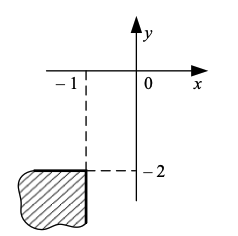 |
|      2      | 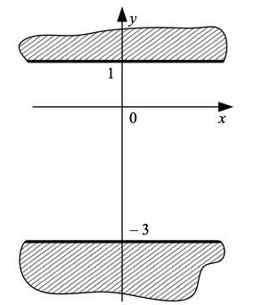 |
|      3      | 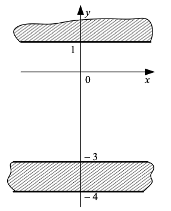 |
|      4      | 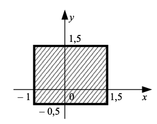 |
|      5      | 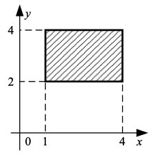 |
|      6      | 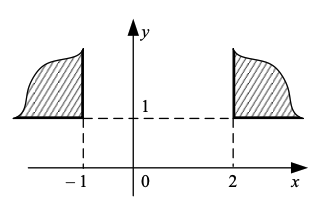 |
|      7      | 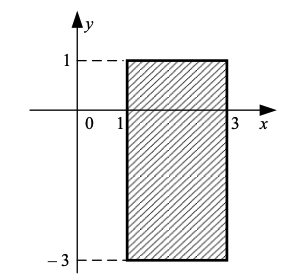 |
|      8      | 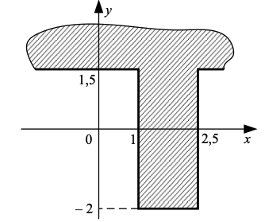 |
|      9      | 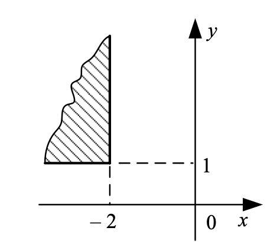 |
|     10      | 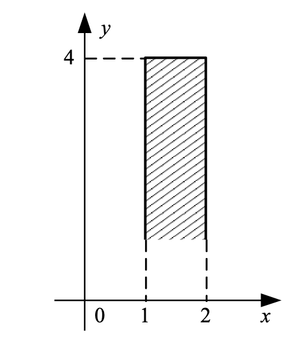 |
|     11      | 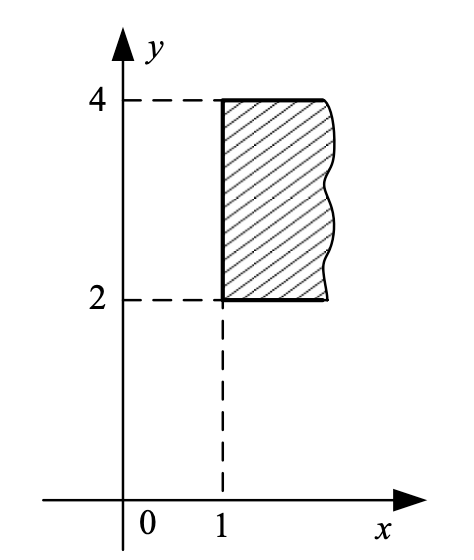 |
|     12      | 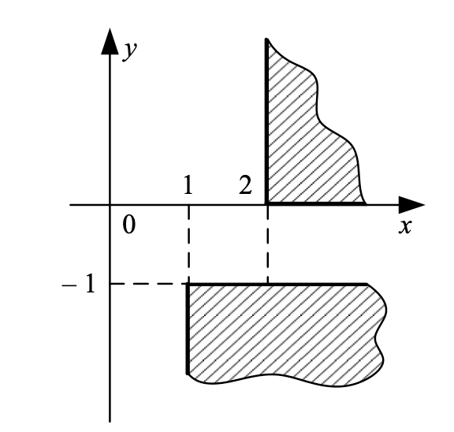 |
|     13      | 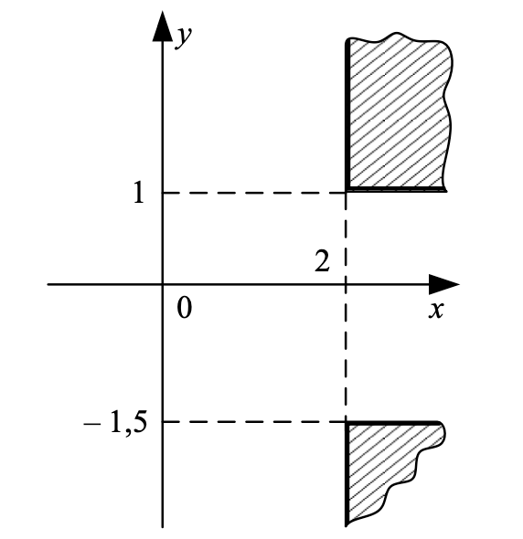 |
|     14      | 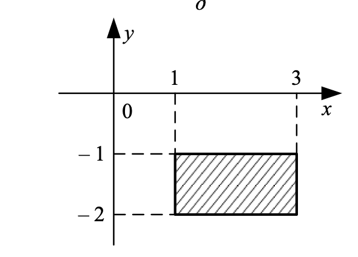 |
|     15      | 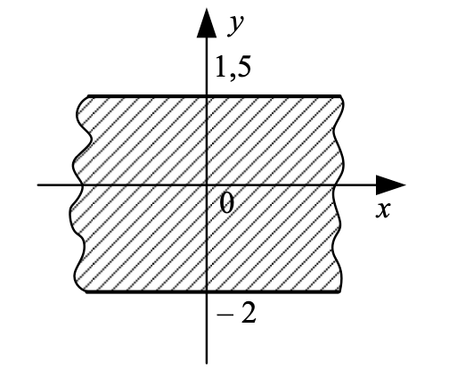 |

## Контрольные вопросы

___

1. Для чего используются условные операторы в программировании?
2. Как выглядит полная форма оператора ветвления в языке Python?
3. Для чего используется часть else в операторе ветвления?
4. Как можно объединить несколько условий в одном условном операторе? Приведите пример.
5. Что означают слова True и False?

## Содержание отчета

___

1. Титульный лист
2. Цель и задачи работы
3. Задание
4. Описание выполнения алгоритма
5. Исходный код программы
6. Результаты работы программы
7. Ответы на контрольные вопросы.
8. Общий вывод о проделанной работе.